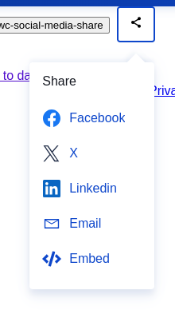
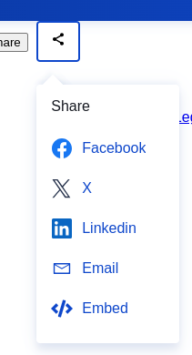

NOTE:

This was originally a kaukana0/eclLikeSocialMediaShare component.
Then it became an EWC component hosted by Bitbucket (ewc-social-media-share).
The EWC component became obsolete and bitbucket and npm repos were deleted.
It was fully replaced by the component ewc-popover-sharing.

So using this here:
- is done by making it part of the application, not a git submodule anymore
- is supposed brigde the time until it will be replaced by ewc-popover-sharing
- is supposed to be short lived, to be able to create deployments
- might lack some features not yet implemented in ewc-social-media-share but already are in ewc-popover-sharing

-----------------------

Displays a popover underneath a 48x45px button containing social media share options.

# Screenshot

looks like this (popover left sided) when omitting attributes *xOffset* and *--arrow-offset* and default values are in effect.

looks like this (popover right sided) with the following attributes:

    xOffset="0px"
    --arrow-offset="-30px"

# API

## There are the following attributes

- **text** - used for FB-sharer and twitter (text parameter)
- **hashtags** - used for twitter
- **mailsubject** - used as subject for email
- **mailbody** - used as body for email
- **buttonvisible** - false hides the button; default=true
- **showEmbed** - if set to false, embed item is omitted. default=true
- **xOffset**
  - a number without unit
  - unit is fixed to be [px]
  - move relative to button (even if button is invisible); 0=left side of popover is aligned w/ left side of button
  - default = -125 + 15 (right side of popover is aligned w/ right side of button)

Note:
Changing these following attributes during runtime is supported: text, hashtags, mailsubject, mailbody, xOffset.
The changes take effect when opening the popup.

## The following property setter is available

- **callback** - called when "embed" is selected, gives one parameter named "url", which contains a string that is actually HTML to be used in order to embed this visualization in another html-page.

### note about the callback

When the user selects "share", then usually a dialog should open up to display a HTML string.
There is a callback mechanism for this.
It then is this component's user's responsability to react - i.e. to show a dialog (e.g. ewc-dialog).

## CSS variables

- **--arrow-offset**
  - move top arrow left or right
  - default=0
  - any CSS unit (e.g. "85px") specifiable
  - run-time change supported (immediate, not only on show)

### Example

Move arrow depending on viewport width.

    ewc-social-media-share {
      --arrow-offset: 85px;
    }

    @media (max-width: 996px) {
      ewc-social-media-share {
        --arrow-offset: 45px;
      }
    }

Note: If there are more than 1 share elements, the CSS can be adapted.

# Usage with WebPack

## package.json

    "dependencies": {
      "@ewc-lib/ewc-social-media-share": "^1.0.0"
    }

## webpack.config.js

    const CopyPlugin = require("copy-webpack-plugin")

    ...

    module: {
      rules: [
        {
          test: /\.css$/i,
          use: [
            'style-loader',
            'css-loader'
          ]
        }
      ]
    },
    plugins: [
      new CopyPlugin({
        patterns: [
          { from: "./node_modules/@ewc-lib/ewc-social-media-share/assets/*", to: "./assets/[name][ext]" },
        ],
      }),
    ],

## index.html

    <!DOCTYPE html>
    <html>

      <head>
        
      </head>

      <body>
          

          <ewc-social-media-share
            text = "This is a demonstration"
            hashTags = "#ewc-lib #ewc-social-media-share"
            mailSubject = "This is an email subject"
            mailBody = "This is the email body"
            style="position: absolute; left:250px;"
            xOffset="0">
          </ewc-social-media-share>

      </body>

    </html>

## index.js

    import "@ewc-lib/ewc-social-media-share"
