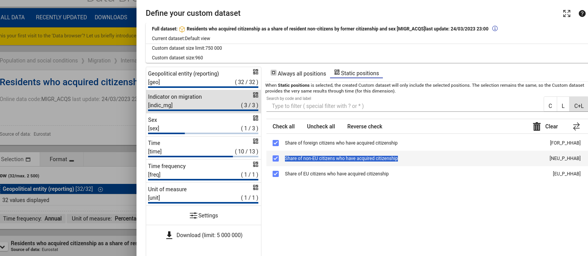
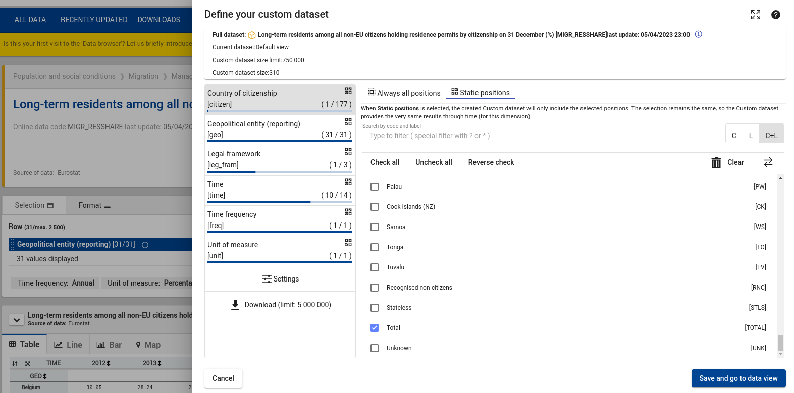

# 11. Various Breakdowns

Date: 2023-07

## Status

Accepted

## Context

A "breakdown" is how a dataset is organized (dimension & codes) to make sense in the business domain.
This dashboard so far supports one kind of breakdown:

6 options to select in the "by Citizenship / by Birth" selectBox, grouped into two groups: 3 * byCitizen and 3 * byBirth.
Associated w/ each of those 6 options is a certain dimension and certain codes of that dimension.

### new requirement

A new requirement came up to support breakdowns that deviate from this "default" one.

E.g. where there are only 3 * byBirth options available, or only 1 option at all - the latter making the selectbox technically superfluous.

Modifying this already implemented funtionality concerns the configuration yaml, selecbox creation, constraint logic and data retrieval (fragment building).

**concerned datasets**

### implementation as it is until now

Some points are hardcoded, thereby assumed and not configurable:
- the mapping of items to dataset-id - see codeMappings.mjs code2DsId.
- the info about which selectBox has the dataset info attached to it (via html attribute)

Deviating from the (until now) only assumed "default" breakdown, there are now two alternatives.

    default             alt1          alt2

    citizen/c_birth (2) indic_mg (2)  citizen
    geo (1)             geo (1)       geo (1)
    sex                 sex           leg_fram (2)
    time (3)            time (3)      time (3)
    freq                freq          freq
    unit                unit          unit

- 1,2,3 indicate the nesting of loops during (multidimensional) data access.
- alt1 = Active citizenship, Naturalisation rate, MIGR_ACQS
- alt2 = Active citizenship, Long-term residence permits, MIGR_RESSHARE

Note: Throughout the sourcecode and the docu, the 2nd dimension is called "by"-dimension, because it's either "by citizen" or "by birth".

### Alternatives

The current implementatin assumes certain aspects, meaning they're hardcoded.
Now, these aspects have to either:

a) be modified for particular exceptions
b) or be made more flexible

## Decision

variant a.

## Consequences

The goal is to keep complexity as minimal as neccessary.
Initial decision: Hardcoding a default makes the code less general and therefore less in complexity.
By adding alternatives, the complexity of the hardcoded approach increases.
So it's worth thinking about generalizing it - i.e. making the neccessary aspects configurable if **[complexity(hardcoded+alternatives) >= complexity(generalized)]**.

### impact

Based on the decision, these points are identified as being impacted by the new requirement:

OK - selectBoxes need new feature: disabled items
- refac / code adaptions
    OK - where to get the dataset from
        - link selectbox-group 2 dataset (discarded idea)
        OK - introduce new card-global dataset config option in yaml
    - mind the constraint logic
    OK - source link
    OK - processors 
      - expect certain order "NEU_FOR" "EU_FOR" etc.
      - more hardcoded codeMappings (sucks already)
    - tooltips
      - undefined or nothing
    OK - there are lines in the dot-plot
- other breakdowns possibly have no "EU" geo. this leads to:
    - unneccessary space at the front in dotplot
    overview:
      - approach1:
        - line color not EU (also in overview)
        - grey out EU in geo-select (for affected cards only!)
        - which default selection for geo when expanding? (political question)
      - approach2:
        - display "No data available" in overview card if no EU data
      - no, completely different solution: show a message ("No data available") in card in overview
