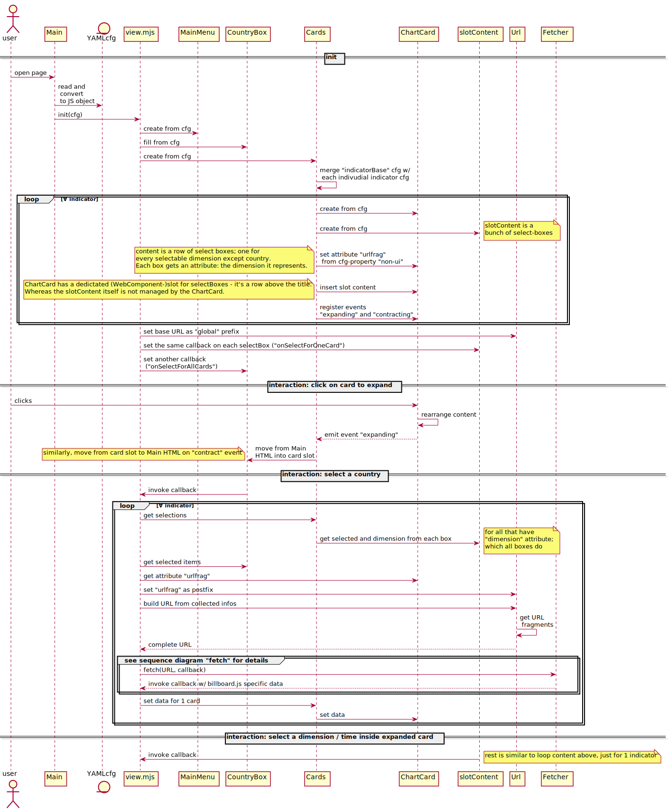

# Project management

[Link](./pm/index.md)

# Architecture decision records

- [Overall Approach](./adr/adr01.md)
- [Config and data retrieval](./adr/adr02.md)
- [Mapping config to UI elements and requesting data](./adr/adr03.md)
- [Main menu](./adr/adr04.md)
- [Select boxes](./adr/adr05.md)
- [Text above select boxes](./adr/adr06.md)
- [Tooltips](./adr/adr07.md)
- [Range slider input](./adr/adr08.md)
- [Range slider config](./adr/adr09.md)
- [Chart colors](./adr/adr10.md)
- [Various Breakdowns](./adr/adr11.md)
- [Handling of "EU" code](./adr/adr12.md)
- [Line-group highligting, Legend and Tooltip](./adr/adr13.md)
- [Async issues](./adr/adr14.md)
- [Menu Navigation](./adr/adr15.md)
- [Responsive behaviour](./adr/adr16.md)
- [Implementation of responsive behaviour](./adr/adr17.md)
- [Accessibility](./adr/adr18.md)
- [Detail Legend](./adr/adr19.md)
- [Icons in Menu Line](./adr/adr20.md)
- [Missing data](./adr/adr21.md)

# Technical details

## the big idea

[the big idea](./technical/theBigIdea.md)

## components

## sequence

## sequence fetch

