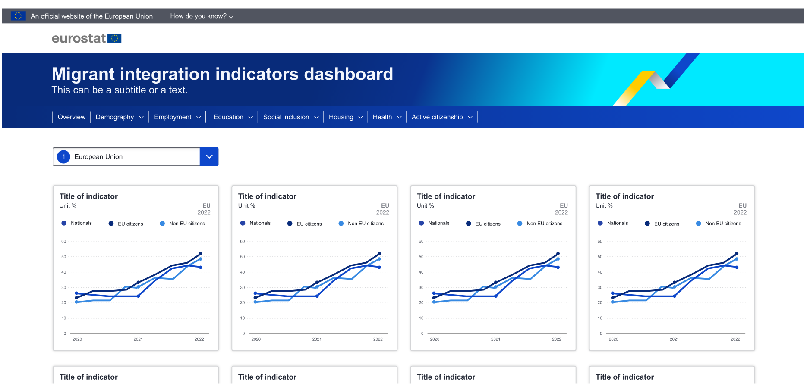
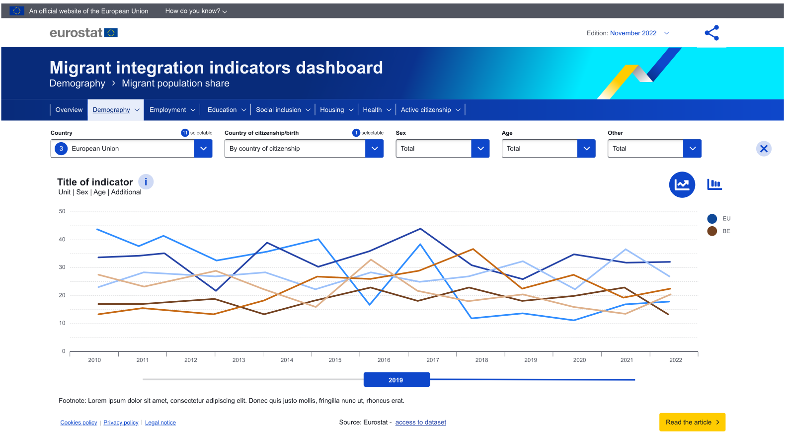
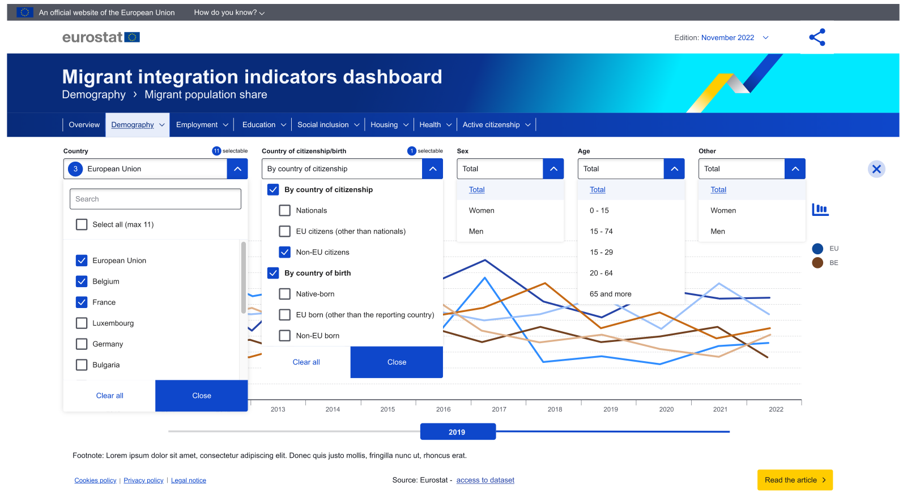
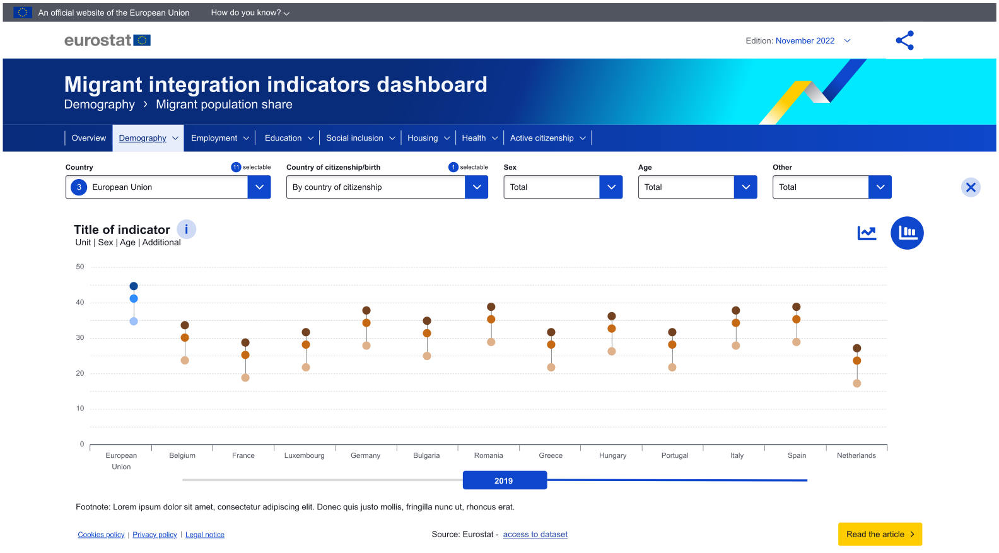
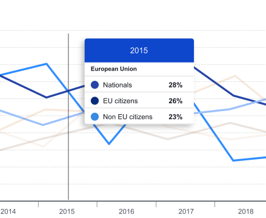
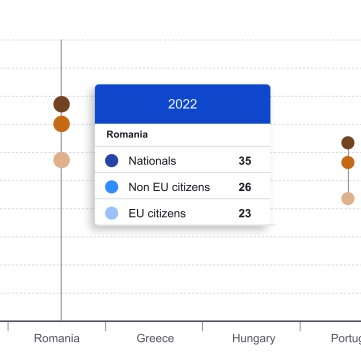

# Intro

The task is to create a website for Eurostat B.4, which presents an interactive overview for various Eurostat data.

In ESTAT B.4 terminology, such an overview is called a "dashboard".

The data comes from a REST API from ESTAT.
It's mainly time-series OLAP data with ~6 dimensions about so called "indicators".

The REST endpoint is the only backend needed - the dashboard itself is purely front-end.

There exist already several dashboards.
However, they're architecturally not readily re-usable to fit the requirements of this particular one.

In essence, regarding the look and feel, this dashboard is supposed to be somewhat similar to the "globalization dashboard":
https://ec.europa.eu/eurostat/cache/dashboard/globalisation

The main differences lie in:
- the look-and-feel: it should adhere to the new stylguide (2022/2023)
- the logic of a certain dropdown-selectBox: it combines two dimensions "c_birth" and "citizen" and allows only for certain combination of selections
- the logic of the max number of lines shown in the line chart (reagrding both, country select and c_birth/citizen select) - see also req750 and req350
- the country's select box's "favourite star" functionality behaves differently (req580)

For more technical details, please see also the "architecture decision records".

# mock ups

## overview

## line chart

## line chart w/ dropdowns

## vertical connected dot plot

## tooltip

# Requirements

## general

- req25: make everything look and behave well on narrow screens (responsive)
- req50: loading indicator (ECL like or from ECL)
- req75: error display
- req80: comply overall with new style-guide (dropdowns, chart, font, etc.)
- req90: comply with accessibility rules (tags, keyboard navigation)

## main menu

- req100: ECL style main menu showing "categories" and indicators in each category as dropdown menu

## overview / expanded view

- req200: an area called "overview" showing cards (resposively)
- req220: cards in overview contain a line-chart + legend and some information:
  - Title of the indicator (card title) unit (card subtitle) on the left side
  - Country and latest period displayed (on the right side)
  - "by"-selection as legend
- req240: cards can be expanded to present more selections and to offer two different charts (switchable): a line-chart (as in the overview) and a dot-plot
- req250: the line chart shows a selection of countries and indicators, the dot plot shows all countries
- req260: time-range slider on the bottom of the charts in expanded view
- req261: must be individually configurable for each card
- req270: info link in expanded card

## chart

- req300: chart tooltip: User can see data for the trend line when mouse overing, year in header, see screenshot
- req325: number of decimals configurable per chart
- req350: max line selection logic in expanded card's line chart:
  - In the expanded view, users should have the possibility of selecting two countries more for comparison purposes in the trend line. Max display two countries – 6 lines shown.
  - If users wish to select more countries they should select only one "by"-dimension.

## selectboxes

- req400: generally, all selectboxes will look like ECL, but: 
  - no search functionality, no select all/none, no close button, 
- req420: selectbox component features a "favorite star" functionality: single select star visible on the right - outline when deselected, filled when selected.
  - this is only used in the country select box
- req430: DIMENSION sex: total/woman/men
- req440: DIMENSION age: depends on config for concrete indicator
- req450: it should be possible to add additional dimensions via config, seperately for each indicator
- req460: default selected entry for each select box (per indicator)
- req470: show # of selectable above geo and by box
- req471: show box labels

### country selectbox

- req500: in the overview, just 1 country can be selected (country singleselect)
- req520: the country selector is available in the overview and inside every card
- req540: the country selector in the card is multiselect and has "favorite star" functionality
- req560: the country selector in overview is single select, no checkboxes, "favorite star"
- req580: country selectbox favorite star functionality: whatever is selected in expanded, when switching to overview, the favourited country becomes selected in overview
- req590: country selection in dot plot highlites countries

### by selectbox

- req700: "by selectbox": c_birth/citizen combi selectBox ("by-selectbox") should be displayed like this:
  - By country of citizenship 
      - [checkbox] Nationals
      - [checkbox] Citizens of another EU country
      - [checkbox] Citizens of a non-EU country
  - By country of birth
      - [checkbox] Native-born
      - [checkbox] Born in another EU country
      - [checkbox] Born in a non-EU country
  - both groups separated by a line, ECL style
- req750: DIMENSION c_birth/citizen combi selection logic
  - there's no "whole group" checkbox
  - 3 of citiz or 3 of birth selectable, exclusively
  - if 1 of citiz' selected, click on birth, makes that 1 birth selected, all citiz deselected - similar for "of birth" 
  - when only 1 by-select, max 10 countries selectable
- req770: by-selectbox in dot plot similar to line chart (2 3-groups), min. 1 by-selection is shown (resulting in 1 dot per country)

## default selections

- req800: defaults after loading the page:
  - 12 cards/indicators in the overview (configurable which one)
  - EU is selected
  - For each indicator, display by default 3 lines:
    - nationals
    - EU citizens (other than nationals)
    - Non EU citizens
- req810: reset card selections to default when going into overview

## export image

- req900: there should be a button that exports currently visible chart to png/jpeg image

## cards

- req1000: info link ("info about this indicator") in cards
