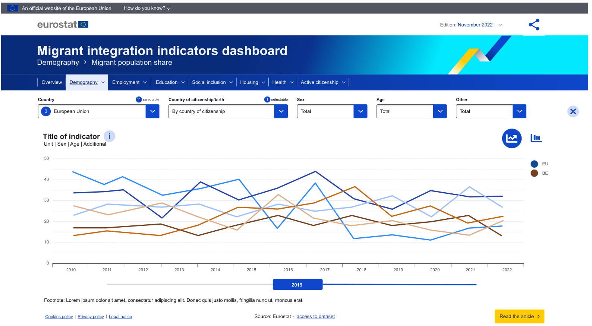
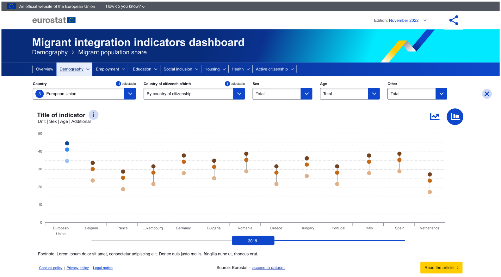

# Intro

The task is to create a website for Eurostat B.4, which presents an interactive overview for various Eurostat data.

In ESTAT terminology, such an overview is called a "dashboard".

The data comes from a REST API from ESTAT.
It's mainly time-series OLAP data with ~6 dimensions about so called "indicators".

The REST endpoint is the only backend needed - the dashboard itself is purely front-end.

There exist already several dashboards.
However, they're technically not readily re-usable to fit the requirements of this particular one.

In essence, it is supposed to be similar to the "green deal dashboard":
https://ec.europa.eu/eurostat/cache/egd-statistics/

The main differences lie in:
- the look-and-feel: it should adhere to the new stylguide (2022/2023)
- the logic of a certain dropdown-selectBox: it combines two indicators c_birth and citizen and allows only for certain combination of selections
- the logic of the max lines shown (reagrding both, country select and c_birth/citizen select) - see also req600
- the country select box doesn't have "favourites" functionality and behaves differently

For more technical details, please see also the "architecture decision records".

# Requirements

- req100: cards containing a line-chart and additional information are displayed in an overview
- req150: in the overview, just 1 country can be selected (country singleselect)
- req175: chart tooltip: User can see data for the trend line when mouse overing
- req200: the country selector is available in the overview and inside every card
- req225: the country selector in the card is multiselect
- req250 additional info in a card:
  - Title of the indicator (card title) unit (card subtitle) on the left side
  - Country and latest period displayed (on the right side)
- req300: a card can be "expanded" (on click) to show more information and to present more selections
- req400: an expanded card can show two different charts: a line-chart (as in the overview) and a combination-chart
- req450: the line chart shows a selction of indicators, the combination-chart shows all countries
- req500: defaults after loading the page:
  - 12 cards/indicators in the overview
  - EU is selected
  - For each indicator, display by default 3 lines:
    - nationals
    - EU citizens (other than nationals)
    - Non EU citizens
- req600: max line selection logic:
  - In the expanded view, users should have the possibility of selecting two countries more for comparison purposes in the trend line. Max display two countries – 6 lines shown.
  - If users wish to select more countries they should select only one dimension. Pop up informing when the user tries to select more countries. 
- req700: c_birth/citizen combi selectBox should be displayed like this:
  - By country of citizenship 
      - Nationals
      - EU citizens (other than nationals)
      - Non-EU citizens 
  - By country of birth
      - Native-born
      - EU born (other than the reporting country)
      - Non-EU born 
- req750: DIMENSION c_birth/citizen combi selection logic
  - If the user wants to select dimensions “by country of birth”, then dimensions “by country of citizenship” should be not clickable and the opposite 
- req760: DIMENSION sex: total/woman/men
- req770: DIMENSION age: depends on config for concrete indicator
- req780: it should be possible to add additional dimensions via config, seperately for each indicator

# mock ups

## overview

## line chart

## line chart w/ dropdowns

## combination chart

## tooltip

# TODOs

1. ~~collect requirements (first iteration as a basis)~~ 3/23
2. ~~decide for overall approach and general source-code structure~~ 1/23
3. ~~decide how to configure what the app displays, datasources and possibly behaviour details~~ 1/23
4. ~~decide data retrieval behaviour~~ 1/23
5. implement first working prototype (as POC)
  5.1. fetch data in accordance w/ selection and display multiple lines
6. update components used to follow new style-guide: dropdownBox, chart
7. implement main menu
8. ~~implement card WebComponent~~ 2/23
9. ~~implement line chart~~ 3/23
10. implement combination chart
11. ~~solve countryBox being used in 2 different places in DOM~~ 2/23
12. adapt chart legend and tooltip
13. implement time range slider in cards
14. implement info link ("info about this indicator") in cards
15. implement footer links
16. ~~implement dropdown Boxes creation from config~~ 3/23
17. config & value extraction: consider all differences in metadata regarding dimensions
